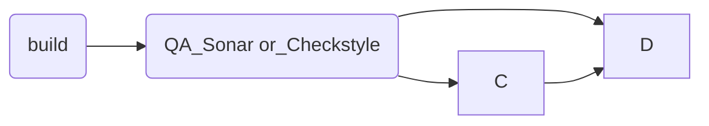

# Pitufos
## Introduccion
SE trata de un **ABMC**(Alta Baja Modificacion y Consulta), tambien conocido como **CRUD**(Create Read Update Delete) de pitufos.
Donde un pitufo tiene un **nombre**, un **ID**, **fuerza** (un numero en el rango [0..100])
## Issues
1. read all pitufos
2. read pitufo by **ID**
3. read pitufos by **name**
	- busqueda por **LIKE**
	- no diferenciar *mayuscula* de *minuscula*
4. update de un pitufo por **ID**
	- update *name*, *fuerza*
	- retornar codido de error si no se encuentra pitufo con ese *ID*
5. delete de un pitufo
6. *Unit test* de *Service*

## Requisitos

1. pitufos *persist* or *save* into **H2** *db*
2. use **Flyway** ==> *sincronizar* la *db*
3. @notation personalizada similar a **@Timed**
4. Herencia de **Exception**
5. *Integration Test*
6. crear *dockerfile*
7. usar *cache* en *request*
8. usar *swagger* para documentar la *API*
9. uso de *security*
	- **JWT**
	- **Bearer**
10. **SOLID Principles**
11. **TDD**

## Resolucion

1. crear repo en **github**
2. usar **spring-boot** para crear esqueleto del proyecto
3. crear directorio ** \webhook\ ** para el manejo de las *actions* de **github**
4. crear estructura
	- como no es posible enviar directorios vacios, se crea al menos una clase por directorio
		- tanto para * \test * como para * \main*
		- luego para las capas queda algo como:
			- **/config**
			- **/configuration**
			- **/controller**
			- **/model**
			- **/repositoty**
			- **/service**
			- **/dto**
			- **/exception**
			- **/security**
			- **/entity**
			- **/persistence**
			- **/util**
			- **/constant**
			- **/validator**
			- **/dto**
			- **/annotation**
			- **/request**
			- **/response**
			- **/mapper**
			
			
## Pasos
repo de prueba
Para poder generar un proyecto se usa spring-boot que permitira crear el esqueleto
**prerequisitos**
comando `curl` instalado

listado
- [x] #739
- [ ] https://github.com/octo-org/octo-repo/issues/740
- [ ] Add delight to the experience when all tasks are complete :tada:

se realiza el build con github actions

