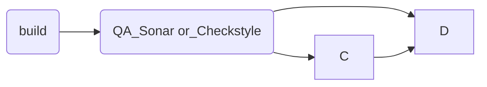

# luna
repo de prueba
Para poder generar un proyecto se usa spring-boot que permitira crear el esqueleto
**prerequisito**
comando `curl` instalado

- [x] #739
- [ ] https://github.com/octo-org/octo-repo/issues/740
- [ ] Add delight to the experience when all tasks are complete :tada:

se realiza el build con github actions

